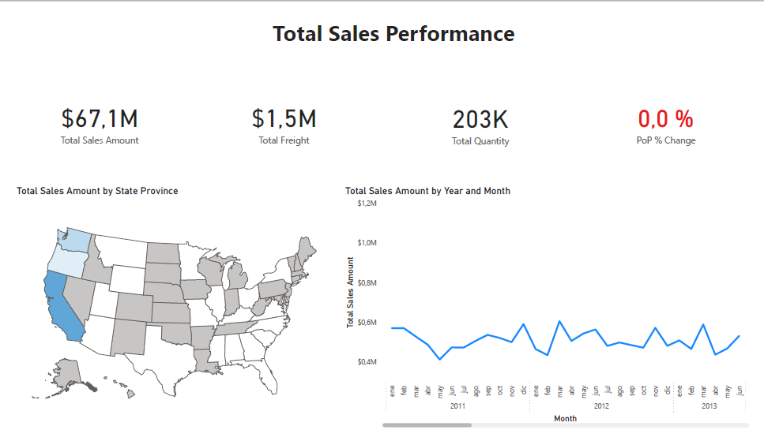
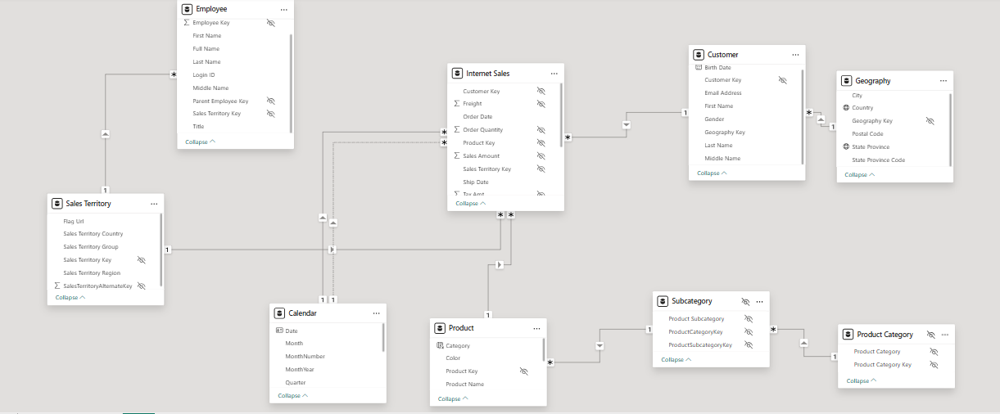

# US Sales Performance Dashboard | Power BI

End-to-end Power BI dashboard designed to analyze sales performance across the US market, combining data modeling, DAX time intelligence and executive-level visualization.

This repository provides the technical context behind the dashboard, including the analytical approach, data model design and key calculations.

---

## Project Overview

This project focuses on transforming raw sales data into actionable insights through a well-structured data model and clear, business-oriented visualizations.

The dashboard is designed to support performance monitoring, trend analysis and high-level decision-making.

---

## Dashboard Objective

- Monitor overall sales performance and cost structure
- Analyze year-over-year evolution using time intelligence
- Identify geographic patterns and performance differences by state
- Provide a clear and scalable analytical view for business stakeholders

---

## Key KPIs & Metrics

- **Total Sales Amount**
- **Total Quantity Sold**
- **Total Freight Cost**
- **Year-over-Year % Change (PoP)**
- **Sales Evolution Over Time**
- **Sales Distribution by State**

---

## Data Model

- Star schema optimized for analytical queries
- Fact table containing transactional sales data
- Dimension tables for:
  - Calendar (custom Date table)
  - Geography
  - Product
- Clean relationships designed to support time intelligence and filtering performance

📌 *A dedicated Date table is used to enable accurate YTD and YoY calculations.*

---

## DAX & Analytical Logic

The model includes reusable and performance-oriented DAX measures, such as:

- `CALCULATE`
- `TOTALYTD`
- `SAMEPERIODLASTYEAR`
- Custom Year-over-Year and PoP % calculations

The focus is on clarity, correctness and scalability rather than overly complex expressions.

---

## Visual Design & Storytelling

Visuals are designed to guide the analysis from high-level KPIs to more detailed breakdowns:

- KPI cards for immediate performance visibility
- Line charts to track trends over time
- Map visuals to highlight geographic patterns
- Consistent layout and color usage to support readability

The goal is to communicate insights quickly and clearly, not just display data.

---

## Tools & Skills Demonstrated

- Power BI Desktop
- Power BI Service
- Data modeling (star schema)
- DAX time intelligence
- Data visualization & dashboard design
- Analytical thinking and business-oriented reporting

---

## Live Dashboard (Power BI Service)

👉 **View the interactive dashboard (Power BI Service – Public):**  
[Open dashboard](https://app.powerbi.com/view?r=eyJrIjoiYTkxNjkzMDUtNDMwYS00OTE3LThiZjYtYWY4NmRhOWIxNDRhIiwidCI6IjY5ZDZjMzNmLWM4ZjMtNDdlNi1hNGM5LTQ2NzE5YjliNTkyOSIsImMiOjl9)

---

## Project Preview

**Dashboard View**  
Executive-level sales overview and trend analysis. 

**Data Model Schema**  
Star schema supporting time intelligence and scalable reporting. 

---

## Recruiter Notes

This project reflects a junior BI profile capable of:
- Designing clean and scalable data models
- Writing effective DAX measures for business analysis
- Translating data into clear, decision-oriented dashboards
- Communicating insights with structure and clarity

The repository is intentionally focused on analytical quality and professional standards rather than experimentation.

---

